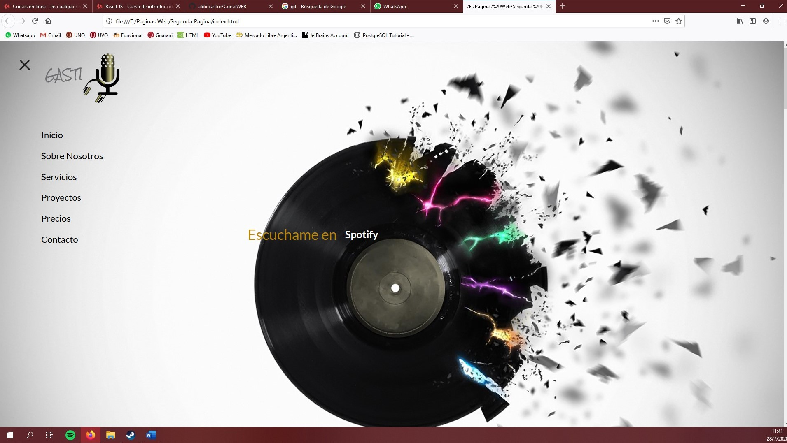
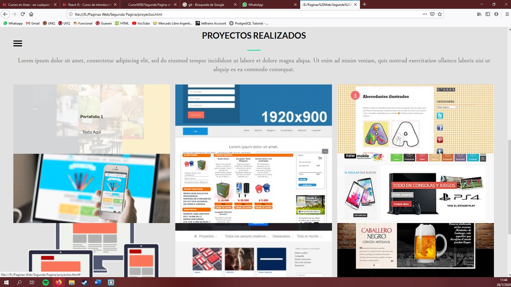
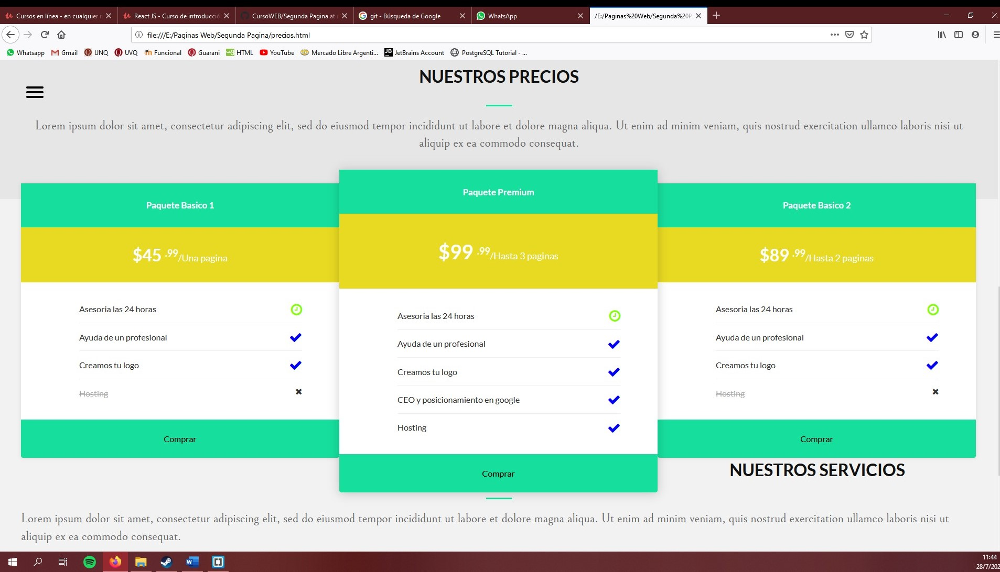

# CursoWEB
Archivos de las páginas WEB que aprendí a hacer gracias a un curso de UDEMY donde vi HTML, CSS y JAVASCRIPT.
Son tres páginas WEB, por ahora tengo subida solo dos a este repositorio.
Para complementarlo estoy haciendo otros cursos de REACT.

## Página de Inicio (index.html)

## Página de Proyectos(proyectos.html)

## Página de Precios (precios.html)

